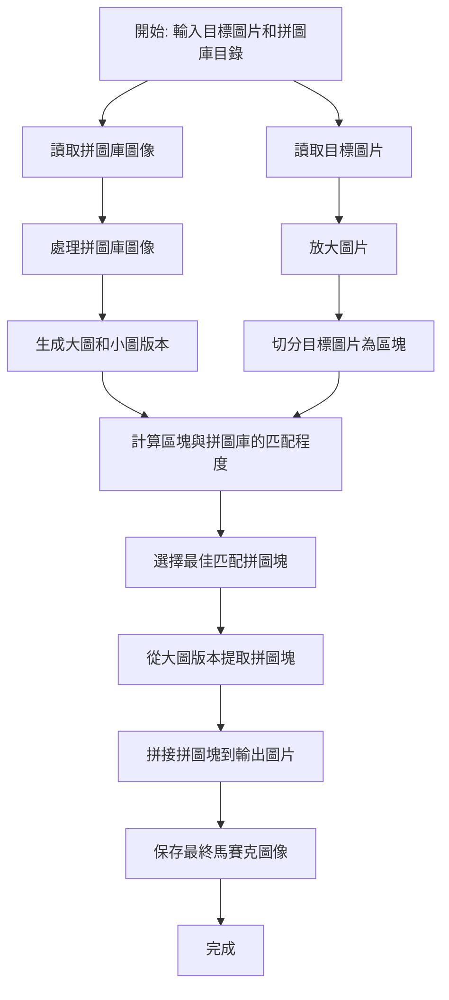

# Photomosaic

## Baseline
> Ref : 
> * https://github.com/codebox/mosaic
> 
> Dataset : [kaggle - animal dataset](https://www.kaggle.com/datasets/snmahsa/animal-image-dataset-cats-dogs-and-foxes?resource=download)

### Flowchart

### 重要參數

- `TILE_SIZE` : tile 的大小，越小細節會越明顯
- `TILE_MATCH_RES` : `small_tile_img` 的 size 公式 =  $\max(\min(\text{TILE_MATCH_RES}, \text{TILE_SIZE}), 1)$，增加 `TILE_MATCH_RES` 會提高每個區塊的匹配精度，因為每個拼圖塊會按更高解析度（細節更多）參與比較
- `ENLARGEMENT` : 馬賽克的圖片會放大 `ENLARGEMENT` 倍，目的是保持細節，這樣放大看處理後的圖片可以清楚看到小圖 tile。

### 實作細節 
(不太重要，只是方便 trace code 而已，可直接看 [Take away](#Take-away) )
#### **1. 前置步驟**
1. **準備拼圖庫 (`TileProcessor`)**
   - 從指定目錄讀取所有拼圖圖像。
   - 將每張拼圖圖像裁剪成正方形，並生成兩個版本：
     - **大圖版本 (`large_tile_img`)**: 尺寸與單個目標區塊相同，用於最終拼接。
     - **小圖版本 (`small_tile_img`)**: 壓縮到較低解析度，用於匹配計算（解析度由 `TILE_MATCH_RES` 決定）。

2. **處理目標圖片 (`TargetImage`)**
   - 讀取目標圖片，放大 `ENLARGEMENT` 倍，以提升馬賽克效果的清晰度。
   - 切分目標圖片，使其每個區塊的大小與拼圖庫的圖塊匹配。

#### **2. 核心匹配邏輯**
目標是找出每個區塊中與拼圖庫最接近的一塊，以下是步驟：

##### **(1) 計算顏色差異 (`TileFitter`)**
使用 `__get_tile_diff` 方法比較兩個圖塊的顏色差異，方法如下：
   - 將目標區塊和拼圖庫的圖塊轉為 RGB 像素數據（即像素的三原色值 `R, G, B`）。
   - 對每個像素的 RGB 值，計算平方差 (差的平方能強調更大的差異)：
     $$
     \text{diff} += (R_1 - R_2)^2 + (G_1 - G_2)^2 + (B_1 - B_2)^2
     $$
   - 若當前差異超過當前最小值（`min_diff`），提前中止，避免浪費計算資源。

##### **(2) 選擇最佳拼圖塊**
使用 `get_best_fit_tile` 方法：
   - 遍歷拼圖庫中的所有圖塊，對比顏色差異。
   - 保存差異最小的圖塊的索引，即為最佳匹配。

---

#### **3. 並行化與分工處理**
由於目標圖片可以分為多個區塊，匹配每個區塊的計算可以獨立進行，因此程式使用多進程來加速計算：
1. **分工任務 (`fit_tiles`)**
   - 將每個目標區塊的像素數據（小圖版本）放入工作佇列 (`work_queue`)。
   - 每個工作進程獨立處理佇列中的區塊，計算出最佳匹配的拼圖索引，並將結果放入結果佇列 (`result_queue`)。

2. **結果合併 (`build_mosaic`)**
   - 收集每個區塊的匹配結果，從拼圖庫的大圖版本中提取匹配的拼圖塊。
   - 按照原始區塊的位置，將拼圖塊拼接到輸出圖像。

### Take away
1. 用 `small_tile_img` 加速 matching 的過程，`small_tile_img` 是將 tile 的解析度縮小後的版本，執行色差計算時速度較快。(即使解析度降低，縮小版本的拼圖塊仍然能大致保留原圖的整體顏色和特徵，這對於 tile matching（基於顏色或亮度）已經足夠。)
2. 用了平行計算加速
3. 找相似度的公式 : [TileFitter](#1-計算顏色差異-TileFitter)
4. 這個 baseline 沒有想到 tile 重複使用的問題，如果要考慮重複使用的話，可以參考這篇 paper : https://arxiv.org/pdf/1804.02827 

# mosaic

This utility can be used to generate [photo-mosaic](http://en.wikipedia.org/wiki/Photographic_mosaic) images, to use it you must have Python installed, along with the [Pillow](http://pillow.readthedocs.org/en/latest/) imaging library.

As well as an image to use for the photo-mosaic ([most common image formats are supported](http://pillow.readthedocs.org/en/latest/handbook/image-file-formats.html)), you will need a large collection of different images to be used as tiles. The tile images can be any shape or size (the utility will automatically crop and resize them) but for good results you will need a lot of them - a few hundred at least. One convenient way of generating large numbers of tile images is to [extract screenshots from video files](https://trac.ffmpeg.org/wiki/Create%20a%20thumbnail%20image%20every%20X%20seconds%20of%20the%20video) using [ffmpeg](https://www.ffmpeg.org/).

Run the utility from the command line, as follows:

<pre>python mosaic.py &lt;image&gt; &lt;tiles directory&gt;
</pre>

*   The `image` argument should contain the path to the image for which you want to build the mosaic
*   The `tiles directory` argument should contain the path to the directory containing the tile images (the directory will be searched recursively, so it doesn't matter if some of the images are contained in sub-directories)

For example:

<pre>python mosaic.py game_of_thrones_poster.jpg /home/admin/images/screenshots
</pre>

The images below show an example of how the mosaic tiles are matched to the details of the original image:

  
Original

  
Mosaic Detail (click through for [full mosaic](https://codebox.net/assets/images/mosaic/mosaic_large.jpg) ~15MB)

Producing large, highly detailed mosaics can take some time - you should experiment with the various [configuration parameters](https://github.com/codebox/mosaic/blob/master/mosaic.py#L6) explained in the source code to find the right balance between image quality and render time.

In particular the [TILE_MATCH_RES](https://github.com/codebox/mosaic/blob/master/mosaic.py#L8) parameter can have a big impact on both these factors - its value determines how closely the program examines each tile when trying to find the best fit for a particular segment of the image. Setting TILE_MATCH_RES to '1' simply finds the average colour of each tile, and picks the one that most closely matches the average colour of the image segment. As the value is increased, the tile is examined in more detail. Setting TILE_MATCH_RES to equal TILE_SIZE will cause the utility to examine each pixel in the tile individually, producing the best possible match (during my testing I didn't find a very noticeable improvement beyond a value of 5, but YMMV).

By default the utility will configure itself to use all available CPUs/CPU-cores on the host system, if you want to leave some processing power spare for other tasks then adjust the [WORKER_COUNT](https://github.com/codebox/mosaic/blob/master/mosaic.py#L12) parameter accordingly.
