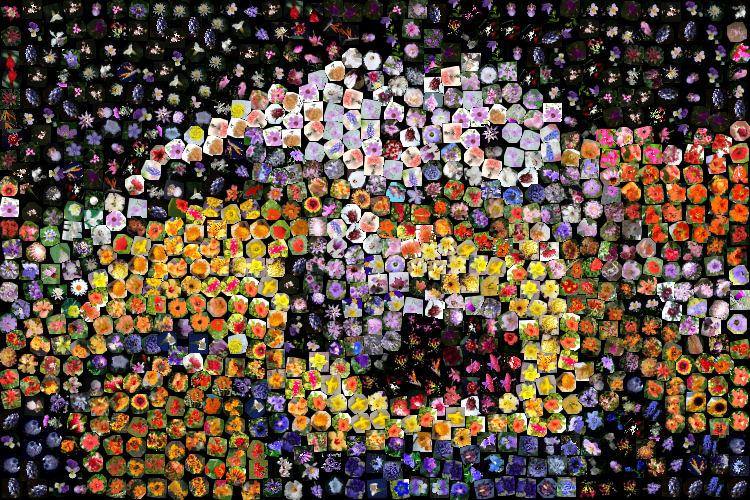

# Photomosaic Generator - Baseline 2 (Irregular Tile)

This implementation is based on the paper [Simulating Decorative Mosaics, Alejo Hausner 2001](https://dl.acm.org/doi/pdf/10.1145/383259.383327)


## Algorithm

This implementation generates photomosaics using a Directional Voronoi Diagram technique. It optimizes tile placement by iteratively refining Voronoi regions influenced by edge detection and user-defined parameters. This advanced approach balances aesthetic quality with computational efficiency.


## Key Features

- **Directional Voronoi Tiling**: Places tiles based on edge-aligned Voronoi regions to improve detail preservation.
- **Edge-Aware Refinement**: Utilizes edge detection and direction fields to guide tile placement.
- **Parallelized Voronoi Computation**: Leverages multiprocessing to speed up the generation process.
- **Configurable Parameters**: Tile size, iteration count, and edge influence weight can be customized.

## Algorithm Overview

1. **Tile Preparation**:
   - Tiles are resized to a uniform size.
   - Average color is precomputed for matching.

2. **Edge and Direction Fields**:
   - Sobel gradients calculate edge magnitudes and directions.
   - Gaussian smoothing refines the fields.

3. **Voronoi Diagram Generation**:
   - Tiles are assigned to regions via a distance field computation, considering edge alignment.

4. **Tile Matching and Placement**:
   - The best-matching tile for each region is chosen based on Euclidean color distance.
   - Tiles are rotated and placed according to the region’s direction.

5. **Iterative Refinement**:
   - Voronoi regions are iteratively updated to align better with edges and image features.

## Requirements

- **Python 3.x**
- **Dependencies**: 
   - OpenCV (`cv2`)
   - NumPy
   - SciPy
   - tqdm
   - Matplotlib

Install dependencies with:
```bash
pip install opencv-python-headless numpy scipy tqdm matplotlib
```

## Usage

### Command-line Execution

```bash
python mosaic_generator.py <image> <tiles_dir> [--tile-size TILE_SIZE] [--iterations ITERATIONS] [--edge-weight EDGE_WEIGHT] [--output OUTPUT]
```

### Parameters

- `<image>`: Path to the input image.
- `<tiles_dir>`: Directory containing tile images.
- `--tile-size`: Size of each tile (default: 50 pixels).
- `--iterations`: Number of iterations for region refinement (default: 20).
- `--edge-weight`: Influence of edge alignment on tile placement (default: 1.0).
- `--output`: Path to save the output mosaic (default: `mosaic.png`).

### Example
Use the [Oxford 102 Flower](https://www.robots.ox.ac.uk/~vgg/data/flowers/102/) as the tile directory

```bash
python photomosaic.py input.jpg 102flowers/ --tile-size 20 --iterations 20 --edge-weight 1.0 --output mosaic.png
```

### Output
- **Original Image**


- **Photomosaic Image**


## Performance and Complexity

### Runtime

The program's runtime is influenced by:
- **Image Size**: Larger images require more Voronoi computations.
- **Tile Count**: More tiles increase matching time.
- **Iterations**: Higher iteration counts improve detail but increase processing time.

## Acknowledgments
Based on the algorithm described in Hausner, Alejo. "Simulating decorative mosaics." Proceedings of the 28th annual conference on Computer graphics and interactive techniques. 2001.

